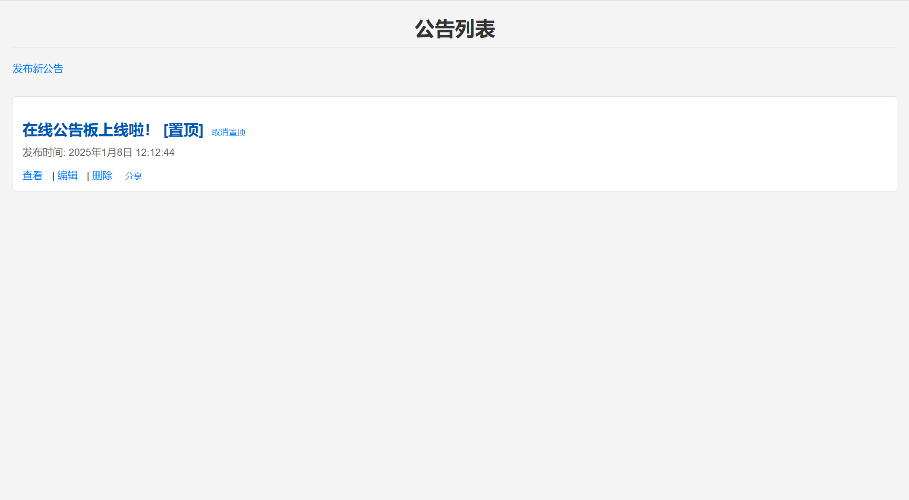
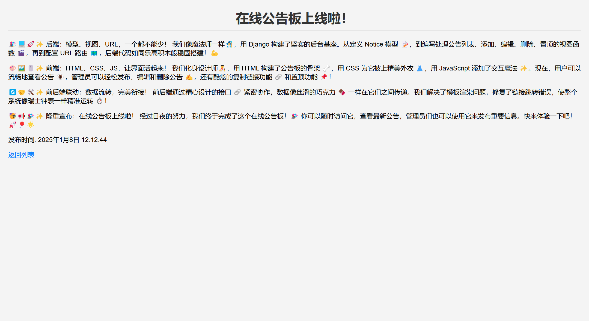
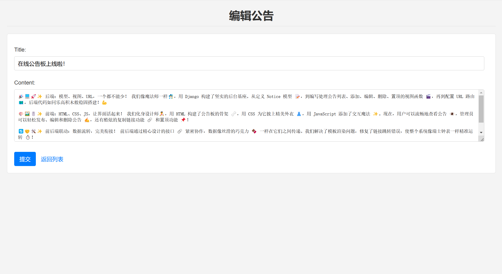

# 在线公告板

[](LICENSE)

这是一个基于 Django 开发的在线公告板项目。该项目允许用户查看和管理公告，并提供管理员权限以执行高级操作。

## 项目截图






## 功能简介

### 普通用户功能

- **查看公告列表**：未登录用户可在首页查看公告列表。
  - 列表显示公告标题和发布时间。
  - 每条公告旁有一个查看按钮，点击跳转到公告详情页。
- **查看公告详情**：支持 Markdown 渲染，显示完整内容和发布时间。
- **公告分享**：可复制公告详情页面的链接，便于分享。

### 管理员功能

- **发布公告**：登录后可以通过表单发布新公告。
- **编辑公告**：修改已发布公告的内容。
- **删除公告**：删除不需要的公告。
- **置顶公告**：管理员可以将重要公告置顶，置顶的公告会优先显示在公告列表顶部。

### 美化设计

- 使用 CSS 美化页面，提供良好的用户体验。

## 技术栈

- **后端**：Django
- **前端**：HTML + CSS
- **数据库**：Django 默认数据库（可根据需求更换）
- **Markdown 渲染**：通过 Django 提供的 Markdown 解析库实现。

## 项目结构

```
bulletinboard/
│
├── .gitignore
├── manage.py
├── requirements.txt
│
├── bulletinboard/
│   ├── asgi.py
│   ├── settings.py
│   ├── urls.py
│   ├── wsgi.py
│   └── __init__.py
│
├── notices/
│   ├── admin.py
│   ├── apps.py
│   ├── forms.py
│   ├── models.py
│   ├── tests.py
│   ├── urls.py
│   ├── views.py
│   └── __init__.py
│
├── static/
│   └── style.css
│
└── templates/
    ├── notice_detail.html
    ├── notice_form.html
    └── notice_list.html
```

## 快速开始

### 环境准备

1. 克隆项目：

   ```bash
   git clone https://github.com/pengmoxiao/Django-Bulletinboard.git
   cd bulletinboard
   ```
2. 创建虚拟环境并安装依赖：

   ```bash
   python -m venv .venv
   source .venv/bin/activate  # Windows 使用 .venv\Scripts\activate
   pip install -r requirements.txt
   ```
3. 初始化setting

   ```bash
   python init.py True
   # 若想要关闭调试模式，请使用
   # python init.py False
   ```
4.迁移数据库：

   ```bash
   python manage.py migrate --run-syncdb
   python manage.py makemigrations
   python manage.py migrate
   ```

5. 创建超级用户：

   ```bash
   python manage.py createsuperuser
   ```
6. 启动开发服务器：

   ```bash
   python manage.py runserver
   ```

### 使用方法

1. 访问首页 (`http://127.0.0.1:8000/`) 查看公告列表。
2. 登录管理员账户以发布、编辑、删除或置顶公告。

## 贡献

欢迎提交 Issue 和 Pull Request 来帮助改进本项目。
